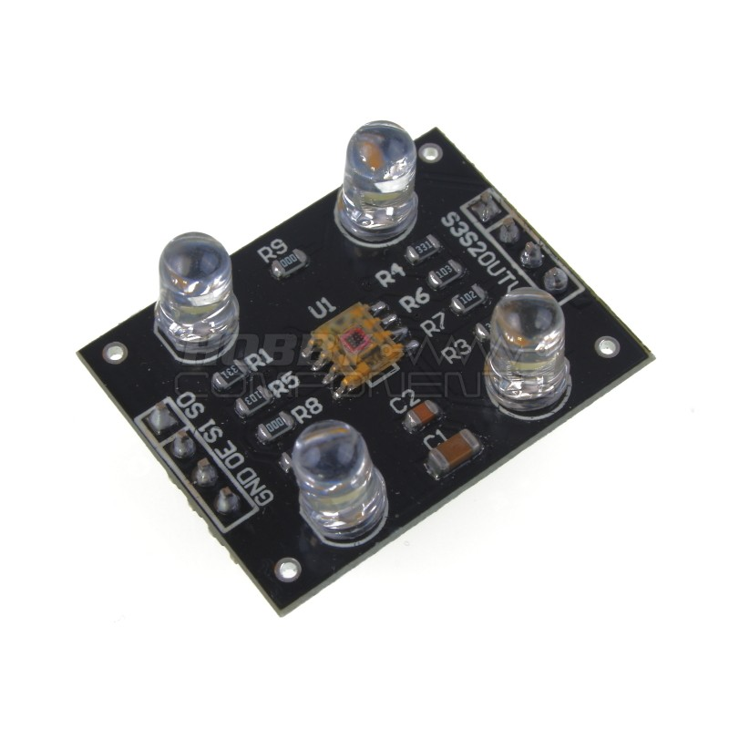
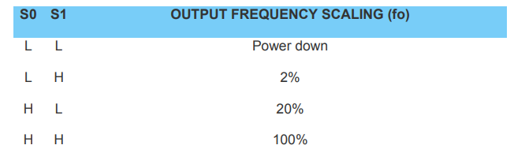
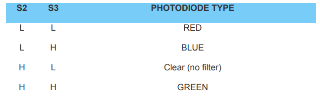

# TCS3200 Colour Sensor 

The repository contains a number of implementations of the colour sensor across a wide variety of microcontrollers and single board computers.

### Colour Sensors

- Used to distinguish colour mixtures of red, blue and green.
- Used in industrial process and quality control.
- Useful in specialized lighting and photography applications.
- Outputs can be digital, analog or variable frequency.
- Sensors consits of an arrays of photodiodes.
- Separate array for each colour.
- Arrays are addressed individually.
- Photodiodes sensitivity changes with colour therefore the output for each colour is non-linear.
- Output is not an RGB value.
- Sensor calibration required to get RGB.
- Some sensors also sense infrared light.

#### TCS230 / TCS3200

- Colour sensor array with variable frequency output.
- Works with 2.7 to 5.5 volts, TTL output.
- Output frequency changes with light intensity.
- Consists of an array of selectable phototransistors, 16 for each colour.
- Selectable output frequency scaling.
- Module has four white LEDs to illuminate subject(s).

The __S0__ and __S1__ inputs on the sensor determine the frequency scaling.

The __S2__ and __S3__ inputs determine the photodiode selection.
